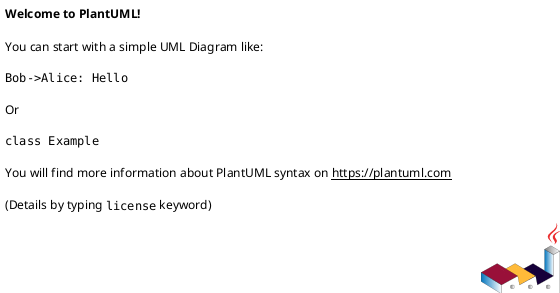

# 3A Studio — Diagram Registry

> **Purpose**: Single source of truth for all PlantUML diagrams in this project.
> Every session MUST read this file first to understand the current diagram inventory.
> Every change to a diagram MUST update this registry.

---

## How to Use This Registry (Session Protocol)

### Session Start
1. Read this file to understand all existing diagrams and their status.
2. Identify which diagrams need modification, creation, or removal.
3. Open the relevant `.puml` files and read their metadata headers.
4. Check `DIAGRAM-CHANGELOG.md` for the last changes made.

### During Session
1. Before modifying any `.puml`, update its `version` and `lastModified` in this registry.
2. Record the change in `DIAGRAM-CHANGELOG.md`.
3. Follow the metadata format defined below.

### Session End
1. Verify all entries in this registry match the actual `.puml` files on disk.
2. Ensure `DIAGRAM-CHANGELOG.md` has a session summary entry.

---

## Metadata Format (inside each .puml)

Each `.puml` file MUST contain this metadata block immediately after `@startuml`:



### Metadata Fields

| Field | Required | Description |
|-------|----------|-------------|
| `id` | Yes | Unique identifier, matches filename (without .puml) |
| `title` | Yes | Human-readable title shown in the diagram |
| `version` | Yes | Semantic version (MAJOR.MINOR). Increment MINOR for changes, MAJOR for rewrites |
| `status` | Yes | `current` = active, `draft` = work in progress, `deprecated` = outdated, `archived` = removed from active use |
| `created` | Yes | Date of first creation (YYYY-MM-DD) |
| `lastModified` | Yes | Date of last change (YYYY-MM-DD) |
| `author` | Yes | Who created/last modified (AI Agent, human name) |
| `diagramType` | Yes | PlantUML diagram type: sequence, class, activity, component, state, deployment, usecase, etc. |
| `scope` | Yes | One-line description of what this diagram covers |
| `dependencies` | No | List of other diagram IDs that this diagram references or relates to |
| `tags` | No | Keywords for searchability |

### Changelog Block (inside each .puml)

Each `.puml` file SHOULD contain a changelog legend at the bottom:

```plantuml
legend right
  **v1.3 (2026-06-12)** Added HITL polling detail
  **v1.2 (2026-06-12)** Fixed router branching logic
  **v1.1 (2026-06-12)** Added cost tracking path
  **v1.0 (2026-06-12)** Initial version
end legend
```

---

## Diagram Inventory

### Active Diagrams (status: current)

| # | ID | Version | Type | Title | Dependencies | Tags |
|---|-----|---------|------|-------|-------------|------|
| 01 | `01-flow-execution-server` | 1.1 | sequence | Flow Execution - Server-Side Path | 02, 04 | flow, execution, server, retry, branching, cost, topo-sort, HITL |
| 02 | `02-flow-execution-client-sse` | 1.1 | sequence | Flow Execution - Client + SSE Paths | 01, 04 | flow, execution, client, SSE, event-bus, topological-sort, branch-routing |
| 03 | `03-self-correction-loop` | 1.1 | sequence | Self-Correction Loop | - | self-correction, LLM, judge, retry, scoring, revision, DB-persistence |
| 04 | `04-websocket-architecture` | 1.1 | sequence | WebSocket + SSE Real-Time Architecture | 01, 02 | websocket, SSE, dead-code, polling, socket-io, real-time, Vercel |

### Draft Diagrams

| # | ID | Version | Type | Title | Notes |
|---|-----|---------|------|-------|-------|
| - | (none) | - | - | - | No drafts currently |

### Deprecated / Archived

| # | ID | Version | Type | Title | Replaced By | Reason |
|---|-----|---------|------|-------|-------------|--------|
| - | (none) | - | - | - | - | - |

---

## Diagram Relationships

```
01-flow-execution-server  <---references---  02-flow-execution-client-sse
        |                                            |
        |                                            |
        +---shared-transport------------------------+
                        |
              04-websocket-architecture (describes WS + SSE transport layer)

03-self-correction-loop (independent, covers self-correction API)
```

---

## Naming Convention

- Format: `NN-category-subcategory.puml`
- `NN` = two-digit zero-padded number (01, 02, ... 99)
- Numbers determine sort order in this registry
- Category and subcategory use lowercase kebab-case
- No spaces, no special characters except hyphens

---

## File Location

All diagrams live in: `/docs/diagrams/`

Supporting files:
- `DIAGRAM-REGISTRY.md` (this file)
- `DIAGRAM-CHANGELOG.md` (detailed change history)